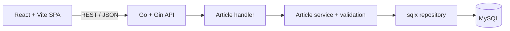

# Article Management

A complete fullstack implementation of the Sharing Vision backend and frontend technical assessments. Editors can create, edit, publish, draft, trash, permanently delete, and preview paginated articles from one responsive dashboard.

## Features

- Published, Drafts, and Trashed article tabs
- Create and edit forms with matching client/server validation
- Status-only move to trash and explicit permanent delete
- Published-only reader preview with pagination
- Loading, error, empty, confirmation, retry, and submission states
- MySQL migrations, Postman collection, automated tests, and CI
- Docker-based local database and production backend image

## Screenshots

Screenshots can be added after the application is running with representative local data.

## Architecture



The repository is a small modular monolith. The backend follows HTTP handler -> service -> repository -> MySQL. The frontend keeps server state in TanStack Query and form state in React Hook Form.

## Technology

Backend: Go, Gin, sqlx, go-sql-driver/mysql, go-playground/validator, `log/slog`, and golang-migrate.

Frontend: React, TypeScript, Vite, React Router, TanStack Query, React Hook Form, Zod, Tailwind CSS, Lucide React, Vitest, and React Testing Library.

## Repository Structure

```text
.
|-- backend/
|   |-- cmd/api/
|   |-- internal/
|   |-- migrations/
|   `-- Dockerfile
|-- frontend/
|   `-- src/
|-- postman/
|-- docs/
|-- .github/workflows/ci.yml
|-- docker-compose.yml
|-- render.yaml
`-- Makefile
```

## Prerequisites

- Go 1.24 or newer
- Node.js 24 and npm
- Docker Desktop with Docker Compose
- `make` for the shortcut commands, or run their underlying commands directly
- golang-migrate for manual migration workflows, or use the provided `make` target

## Local Setup

1. Copy `backend/.env.example` to `backend/.env` and `frontend/.env.example` to `frontend/.env` if you need to override defaults. The backend reads process environment variables; load the file through your shell or IDE.
2. Start MySQL and wait for its health check:

```bash
docker compose up -d mysql
docker compose ps
```

3. Apply the migration:

```bash
make migrate-up
```

4. Start the API:

```bash
cd backend
go run ./cmd/api
```

5. In another terminal, start the frontend:

```bash
cd frontend
npm install
npm run dev
```

Open `http://localhost:5173`. The API and health endpoint run at `http://localhost:8080` and `http://localhost:8080/health`.

## Environment Variables

Backend defaults are suitable for the included Compose database:

```env
APP_ENV=development
PORT=8080
DB_HOST=localhost
DB_PORT=3306
DB_NAME=article
DB_USER=article_user
DB_PASSWORD=article_password
DB_TLS_MODE=false
DB_CA_CERT_PATH=
CORS_ALLOWED_ORIGINS=http://localhost:5173
```

`DB_TLS_MODE=true` enables verified server TLS. When a provider supplies a CA certificate, mount it and set `DB_CA_CERT_PATH`; the application registers a dedicated TLS configuration. Multiple CORS origins are comma-separated.

Frontend:

```env
VITE_API_BASE_URL=http://localhost:8080
```

Never commit real credentials or provider certificates.

## Database and Migrations

The database is named `article`; migration `000001` creates `posts` with the assessment columns and one composite index for status-filtered, newest-first listing.

```bash
make db-up
make migrate-up
make migrate-down
make db-down
```

The migration command uses `golang-migrate` with the local Compose credentials. For another database, invoke the migrate CLI with the desired DSN.

## Commands

Backend:

```bash
cd backend
gofmt -w .
go vet ./...
go test ./...
go build ./cmd/api
```

Frontend:

```bash
cd frontend
npm run lint
npm run typecheck
npm run test -- --run
npm run build
```

Run all checks with `make check`.

## API

| Method | Path | Purpose |
| --- | --- | --- |
| GET | `/health` | Database-backed health check |
| POST | `/article/` | Create an article |
| GET | `/article/:limit/:offset` | List newest articles; optional `status` query |
| GET | `/article/:id` | Get one article |
| PUT | `/article/:id` | Update article fields or status |
| DELETE | `/article/:id` | Permanently delete an article |

Limits must be 1-100 and offsets must be zero or greater. Create requires all fields. Update accepts a partial object, merges it with the stored article, and validates the complete result. Errors use a stable `{ "error": { "code", "message", "fields" } }` envelope.

## Postman

Import `postman/SharingVisionArticleAPI.postman_collection.json`. The collection defines `base_url` and captures the first created article into `article_id`. It includes health, create, filtered and unfiltered lists, detail, update, move-to-trash, and delete requests.

## Deployment

### Backend on Render

1. Create a Blueprint from `render.yaml`, or a Docker Web Service rooted at `backend`.
2. Configure all `DB_*` values from the hosted MySQL provider and set `CORS_ALLOWED_ORIGINS` to the final frontend URL.
3. If Aiven supplies a CA certificate, make it available to the service and set `DB_CA_CERT_PATH`.
4. Apply migrations against the production DSN before serving traffic.
5. Verify `/health` returns `{"status":"ok"}`.

The server binds to `0.0.0.0:$PORT`, shuts down gracefully, and uses a non-root distroless runtime image.

### Frontend on Cloudflare Pages

1. Set the project root to `frontend`.
2. Use build command `npm run build` and output directory `dist`.
3. Set `VITE_API_BASE_URL` to the Render API URL.
4. Deploy after the backend CORS allowlist includes the Pages domain.

`frontend/public/_redirects` routes deep SPA links back to `index.html`.

Deployment URLs:

- Frontend URL: not deployed
- Backend URL: not deployed
- Health URL: not deployed

## Design Decisions

**Why React + Vite?** The UI is a client-side admin dashboard with no SSR requirement. Vite keeps local setup and production builds small and direct.

**Why sqlx?** The domain needs a handful of clear parameterized SQL statements. sqlx reduces scanning boilerplate without hiding SQL behind an ORM.

**Why is the status spelled `thrash`?** That spelling is part of the original assessment contract and is preserved for compatibility.

**Why does Trash not call DELETE?** The frontend requirement says a trashed article must appear under the Trashed tab, so the first action updates its status to `thrash`. The Trashed tab exposes permanent deletion separately.

**Why does DELETE still exist?** Permanent deletion is an explicit backend assessment requirement and remains useful for final cleanup.

**Why no authentication?** It is outside the assessment scope. Adding it would introduce user and authorization concerns unrelated to the evaluated CRUD workflow.

**Why no microservices?** There is one bounded feature and one database. A modular monolith is easier to run, review, test, and deploy.

## Known Limitations

- The API returns arrays rather than total counts, so preview pagination enables Next when the current page is full; a final full page can lead to one empty page.
- There is no authentication, audit history, rich-text editor, image upload, or article search because those are outside scope.
- Migrations are an explicit deployment step and are not run automatically by the API process.
- Hosted URLs and screenshots remain blank until an actual deployment is performed.

